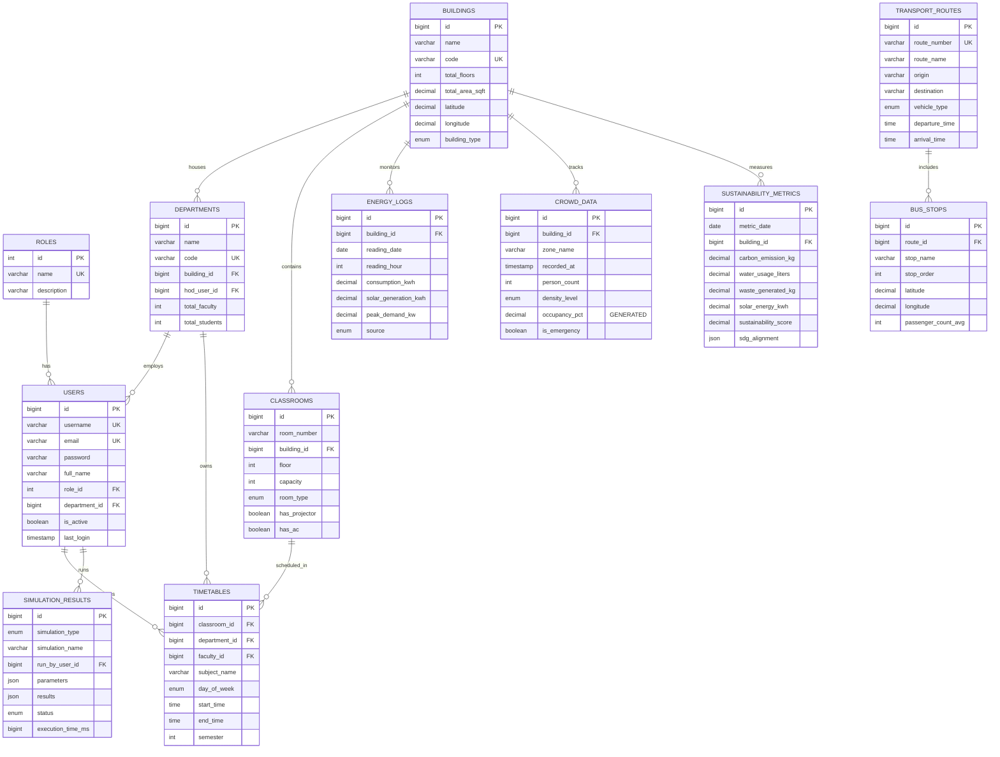

# RIT Digital Twin – ER Diagram & Schema Documentation

## Entity-Relationship Overview

The database is composed of **12 normalized tables** grouped into 4 functional domains, connected by **20+ foreign keys**.

---

## ER Diagram (Mermaid)

---

## Domain Groups

### 1. Identity & Access
| Table | Purpose |
|-------|---------|
| **roles** | Lookup table for ADMIN, MANAGEMENT, FACULTY |
| **users** | All platform users with role FK and optional department FK |

**Relationships:** `roles` 1→N `users`, `departments` 1→N `users`

---

### 2. Campus Infrastructure
| Table | Purpose |
|-------|---------|
| **buildings** | Physical building inventory with geo-coordinates |
| **classrooms** | Rooms within buildings with amenity flags |
| **departments** | Academic departments linked to buildings |
| **timetables** | Class scheduling joining classrooms, departments, and faculty |

**Relationships:**
- `buildings` 1→N `classrooms` (CASCADE delete)
- `buildings` 1→N `departments` (SET NULL on delete)
- `classrooms` + `departments` + `users` → `timetables`
- **CHECK constraint**: `end_time > start_time`, `semester BETWEEN 1 AND 8`
- **UNIQUE constraint**: `(room_number, building_id)` prevents duplicate rooms

---

### 3. Operations & Monitoring
| Table | Purpose |
|-------|---------|
| **energy_logs** | Hourly energy readings per building (kWh, solar, HVAC, lighting) |
| **transport_routes** | Bus/shuttle route definitions |
| **bus_stops** | Ordered stops per route with geo-coordinates |
| **crowd_data** | Real-time crowd density with **generated column** for occupancy % |

**Key Features:**
- `crowd_data.occupancy_pct` is a **STORED GENERATED COLUMN** (`person_count / max_capacity * 100`)
- `energy_logs` supports `SENSOR`, `MANUAL`, and `SIMULATED` data sources
- `bus_stops.stop_order` enforces sequence within routes

---

### 4. Analytics & Simulation
| Table | Purpose |
|-------|---------|
| **simulation_results** | Stores inputs/outputs of any simulation engine as **JSON** |
| **sustainability_metrics** | Daily environmental KPIs per building or campus-wide |

**Key Features:**
- `simulation_results.parameters` and `.results` use **JSON columns** for schema-flexible storage
- `sustainability_metrics.sdg_alignment` stores UN SDG mapping as JSON
- `sustainability_score` constrained to **0–100** range

---

## Normalization Summary

| Normal Form | How Achieved |
|-------------|-------------|
| **1NF** | All columns are atomic; no repeating groups |
| **2NF** | All non-key columns fully depend on the primary key |
| **3NF** | No transitive dependencies; roles, departments, buildings are separate lookup tables |
| **BCNF** | Every determinant is a candidate key |

---

## Indexing Strategy

| Type | Count | Purpose |
|------|-------|---------|
| Primary Keys | 12 | Auto-increment identity |
| Unique Keys | 8 | Prevent duplicates (username, email, codes, route numbers) |
| Foreign Keys | 13 | Referential integrity with CASCADE/SET NULL |
| Composite Indexes | 5 | Multi-column lookups (building+date, day+time, type+status) |
| Single-column Indexes | 30+ | Filter on type, status, date, active flags |
| CHECK Constraints | 8 | Data validation (time ordering, ranges, non-negative values) |

---

## Convenience Views

| View | Purpose |
|------|---------|
| `v_classroom_utilization` | Room usage % based on scheduled slots vs. capacity (36 slots/week) |
| `v_building_energy_daily` | Daily energy aggregation per building |
| `v_route_overview` | Route summary with stop count and passenger totals |
